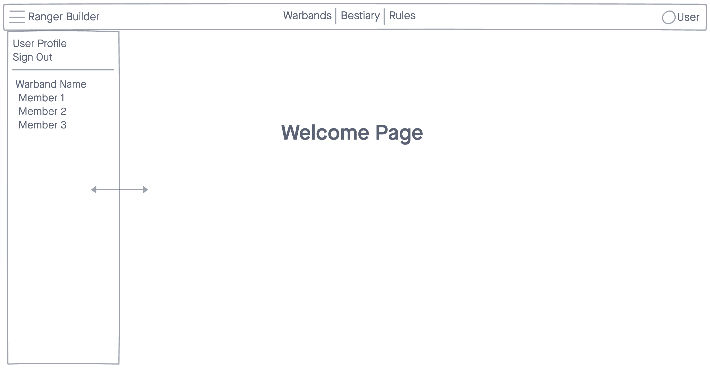

### Date: 11/25/2020

#### By: Michael Lackey

#### [Website](https://michaellackey.com/) | [GitHub](https://github.com/mlackey9601) | [LinkedIn](https://www.linkedin.com/in/michaelglackey/) | [Vettery](https://www.vettery.com/ga/employers)
***

### ***Description***

##### A warband builder for the tabletop game Rangers of the Shadow Deep.
***

### ***Technologies Used***

***

### ***Getting Started***

##### In this section, include the link to your project and any instructions you deem important to get started.
##### A Trello board for this project can be viewed [here](https://trello.com/b/XfxdvytM).
##### The project can be viewed [here](url).
***

### ***Screenshots***

###### Welcome Page Concept

###### Quick Image Description

***

### ***Future Updates***

- [ ] Put items you want to add to your project later in this list
- [ ] Leave the brackets empty for incomplete items
- [x] Put an 'x' in the brackets if you want the item to appear completed
- [x] ~~Put tildes on each side of the item if you want it to be struck out~~
***

### ***Credits***

##### App Scaffolding: [Chajr 1.2.2](https://github.com/davidstinson/chajr)
  
##### Joseph McCullough: [Rangers of the Shadow Deep](https://www.drivethrurpg.com/browse/pub/11264)
  
##### Credit: [Description](url)
***