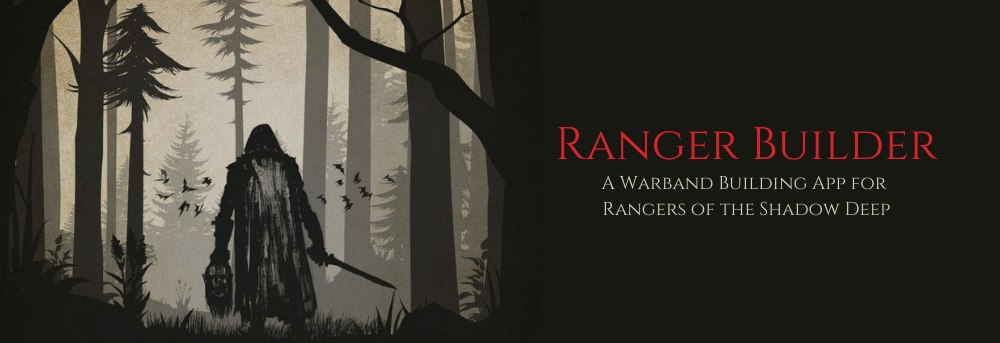
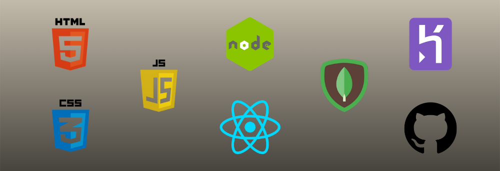
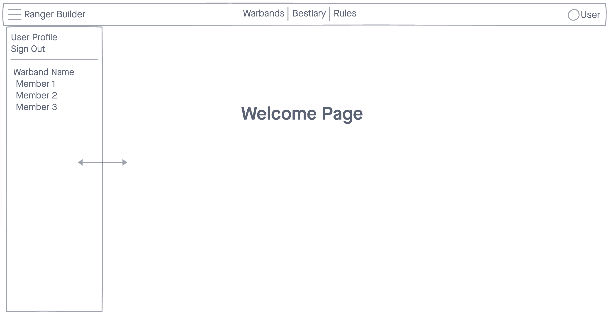

### Date: 11/25/2020

#### By: Michael Lackey

#### [Website](https://michaellackey.com/){:target="_blank"} | [GitHub](https://github.com/mlackey9601){:target="_blank"} | [LinkedIn](https://www.linkedin.com/in/michaelglackey/){:target="_blank"} | [Vettery](https://www.vettery.com/ga/employers){:target="_blank"}
***

### ***Description***

##### A warband builder for the tabletop game Rangers of Shadow Deep.
***

### ***Technologies Used***

***

### ***Getting Started***

##### Sign up and sign in as a new user and then walk through the Ranger creation page to begin your warband.
##### A Trello board was used to keep track of development progress and can be viewed [here](https://trello.com/b/XfxdvytM){:target="_blank"}.
<!-- ##### The project itself was deployed using Heroku and can be viewed [here](url). -->
***

### ***Screenshots***

###### Welcome Page Concept

***

### ***Future Updates***

- [ ] Make the app scale for multiple sized screens
- [ ] Add interactive map section
- [ ] Add a Bestiary section where stats on different enemies can be looked up
- [ ] Add an item lookup section so magic items / herbs / potions can be referenced and added to inventory
- [ ] New users can choose an avatar for their account
- [ ] Users can create multiple warbands
***

### ***Credits***

##### Joseph McCullough: [Rangers of Shadow Deep](https://www.drivethrurpg.com/browse/pub/11264){:target="_blank"}

##### Map of Alladore: [Alexei Vella](https://www.facebook.com/groups/199819667485240/permalink/599052670895269){:target="_blank"}

##### App Scaffolding: [Chajr 1.2.2](https://github.com/davidstinson/chajr){:target="_blank"}

##### Select React Components: [Material-UI](https://material-ui.com/){:target="_blank"}

##### Background: [CSS Gradient](https://cssgradient.io/){:target="_blank"}

***